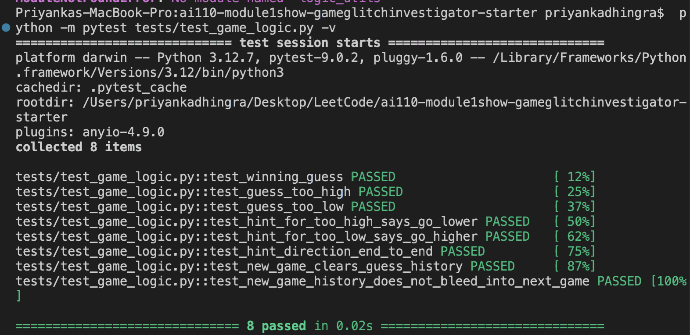
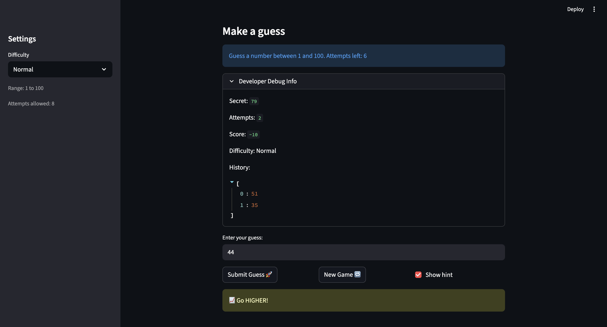

# 🎮 Game Glitch Investigator: The Impossible Guesser

## 🚨 The Situation

You asked an AI to build a simple "Number Guessing Game" using Streamlit.
It wrote the code, ran away, and now the game is unplayable. 

- You can't win.
- The hints lie to you.
- The secret number seems to have commitment issues.

## 🛠️ Setup

1. Install dependencies: `pip install -r requirements.txt`
2. Run the broken app: `python -m streamlit run app.py`

## 🕵️‍♂️ Your Mission

1. **Play the game.** Open the "Developer Debug Info" tab in the app to see the secret number. Try to win.
2. **Find the State Bug.** Why does the secret number change every time you click "Submit"? Ask ChatGPT: *"How do I keep a variable from resetting in Streamlit when I click a button?"*
3. **Fix the Logic.** The hints ("Higher/Lower") are wrong. Fix them.
4. **Refactor & Test.** - Move the logic into `logic_utils.py`.
   - Run `pytest` in your terminal.
   - Keep fixing until all tests pass!

## 📝 Document Your Experience

- [ ] Describe the game's purpose.

The game is a number guessing game where players attempt to guess a secret number generated by the AI. Players receive hints to guide their guesses, but the game initially had bugs that made it unplayable.

- [ ] Detail which bugs you found.

The hints provided were incorrect. "Go Higher" was given for numbers that were too high, and "Go Lower" for numbers that were too low.

Additionally, when starting a new game, the guess history was not cleared, causing previous guesses to persist into the new game.

- [ ] Explain what fixes you applied.

We corrected the logic in the get_feedback_message function to ensure that the hints accurately reflect the player's guesses.

We also cleared History on the New Game button by updating the new game logic to reset the guess history by setting st.session_state.history = [] when a new game starts.

## 📸 Demo

- [ ] [Insert a screenshot of your fixed, winning game here] 

## 🚀 Stretch Features

- [ ] [If you choose to complete Challenge 4, insert a screenshot of your Enhanced Game UI here]
